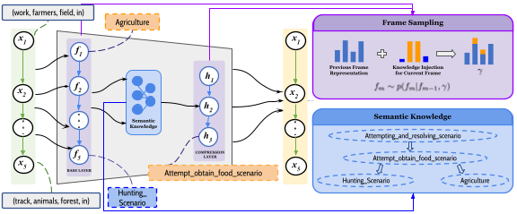

# Semantically-informed Hierarchical Event Modeling


This repository is the official implementation of [Semantically-informed Hierarchical Event Modeling](https://arxiv.org/abs/2212.10547) (Published in *SEM 2023).



## Getting Started
```
git clone https://github.com/dipta007/SHEM
cd SHEM
git checkout missing_grp
```

## Conda Environment
```
conda create -n shem python=3.7
conda activate shem
conda install pip
conda install pytorch torchvision torchaudio pytorch-cuda=11.7 -c pytorch -c nvidia
pip install torchtext==0.2.3
pip install -U scikit-learn
conda install -c conda-forge pytablewriter
conda install -c anaconda pandas
pip install gdown
```

## Data:
```
conda activate shem
pip install gdown
mkdir saved_models
mkdir saved_configs
gdown https://drive.google.com/drive/u/1/folders/1StFmV2L5MiubGYzd5NB-weQpfun-SA6I -O ./data --folder
```


## Usage
### Training:
```
./train.sh $obsv_prob $exp_num $seed
```

### Evaluation:

#### data_mode:
 {'valid','test'}

#### Perplexity:
```
./test_ppx.sh $obsv_prob $exp_num $seed $data_mode
```
#### Wiki Inverse Narrative Cloze:
```
./wiki_inv_narr.sh $obsv_prob $exp_num $seed $data_mode
```
#### Masked Event Prediction:
```
./test_mppx.sh $obsv_prob $exp_num $seed $data_mode
``` 

## ⚠️ Disclaimer

Some parts of the code were inspired by [SSDVAE](https://github.com/mmrezaee/SSDVAE) implementations.